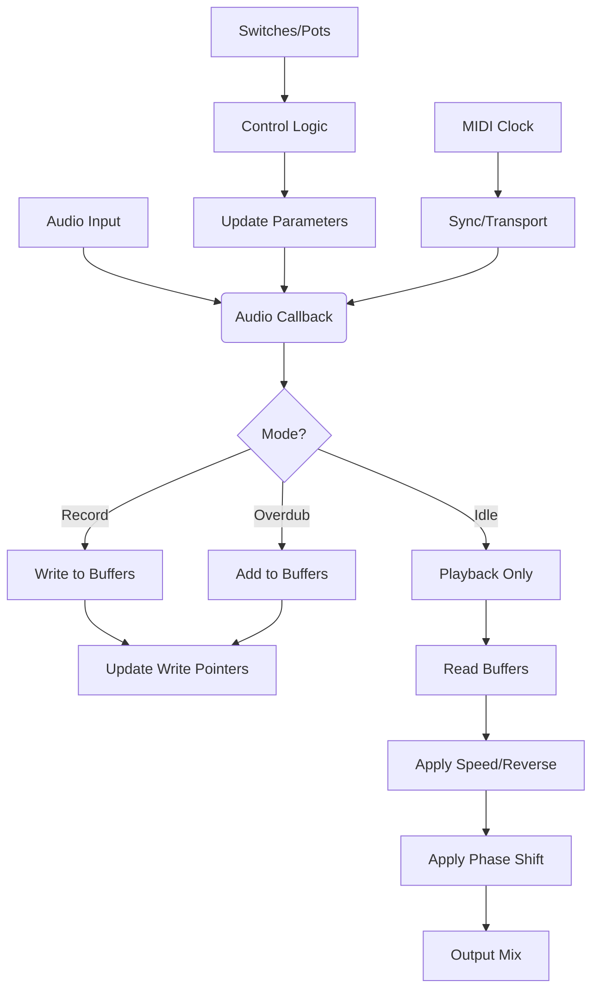

# MySynthSeed – Daisy Pod Looper with Accumulating Phase Shift

## Overview

A stereo looper with independent left/right buffers, designed for the Daisy Seed platform. Implements accumulating phase shift (left loop shorter by one beat) for rhythmic variation, plus MIDI sync, remix, feedback control, and external codec support.

## Features

- **Dual‑mono SDRAM buffers**: Up to 60 seconds each at 48 kHz.
- **Three operating modes**: Record, Idle, Overdub.
- **Feedback states**: Off, Monitor, Record (with adjustable gain).
- **Variable playback speed**: 0.5×, 0.666×, 1×, 1.5×, 2×, plus reverse.
- **Phase‑shift switch**: Shortens the left loop by one beat, causing gradual offset accumulation.
- **Remix function**: Randomly reorders beat segments with optional reverse, double‑speed, or stutter effects.
- **MIDI clock generation**: Sends 24 ppq and responds to sync button.
- **External codec interface**: Additional stereo I/O via SAI2.
- **NeoPixel LED support** (optional): Visual feedback via 24‑LED ring.
- **Configurable loop length**: 3, 4, or 5 base beats with 1×–64× multipliers.
- **Soft limiter** and **feedback gain control**.

## Hardware Requirements

- Daisy Seed board
- 4× potentiometers (volume, feedback gain, speed, beat‑length)
- 10× momentary switches (mode up/down, feedback up/down, reverse, sync, remix, beat up/down, replace, phase shift)
- Optional: NeoPixel ring (24 LEDs) on pin D5
- Optional: External codec (CS42448, etc.) connected via SAI2 pins

## Pin Connections

| Signal          | Daisy Pin | Arduino‑style Pin |
|-----------------|-----------|-------------------|
| Mode Up         | D0        | 0                 |
| Mode Down       | D1        | 1                 |
| Feedback Up     | D2        | 2                 |
| Feedback Down   | D3        | 3                 |
| Reverse Switch  | D4        | 4                 |
| NeoPixel Data   | D5        | 5                 |
| Sync Switch     | D6        | 6                 |
| Remix Switch    | D7        | 7                 |
| Beat Up         | D9        | 9                 |
| Beat Down       | D10       | 10                |
| Phase Shift     | D14       | 14                |
| Replace Switch  | D30       | 30                |
| ADC0 (Volume)   | A0        | –                 |
| ADC1 (FB Gain)  | A1        | –                 |
| ADC2 (Speed)    | A2        | –                 |
| ADC3 (Beat Len) | A3        | –                 |
| ADC4 (Unused)   | A4        | –                 |
| SAI2 FS         | D27       | 27                |
| SAI2 MCLK       | D24       | 24                |
| SAI2 SCK        | D28       | 28                |
| SAI2 SB (TX)    | D25       | 25                |
| SAI2 SA (RX)    | D26       | 26                |

## Architecture Overview

**Key Components:**
- **Buffers**: `left_buffer[]`, `right_buffer[]` in SDRAM, each up to 60 seconds.
- **Playback Engine**: Variable‑speed reading with linear interpolation.
- **Control Layer**: Debounced switches, ADC polling, mode/feedback state machines.
- **MIDI Layer**: UART‑based clock generation and transport messages.
- **External Codec**: SAI2 configured for 48 kHz, 24‑bit stereo I/O.
- **NeoPixel Manager** (optional): Arduino‑compatible library for LED animations.

## Build Instructions

1. Clone the DaisyExamples repository (or ensure `libDaisy` and `DaisySP` are sibling directories).
2. Navigate to `MyProjects/MySynthSeed`.
3. Run `make clean` (optional).
4. Run `make` to compile.
5. Upload the resulting `MySynthSeed.bin` to the Daisy Seed via DFU.

> **Note**: The Makefile expects `../../libDaisy` and `../../DaisySP`. Adjust paths if your workspace differs.

## Usage

### Basic Operation
1. Power on the Daisy Seed.
2. **Record**: Hold **Mode Up** (D0) while playing an instrument. Release to stop recording.
3. **Playback**: The loop repeats automatically. Use the **Speed** pot (A2) to change playback rate; toggle **Reverse** (D4) for backward play.
4. **Overdub**: Hold **Mode Down** (D1) to add new material without erasing the existing loop.
5. **Feedback**: Use **Feedback Up/Down** (D2/D3) to select Off, Monitor, or Record feedback.

### Advanced Features
- **Phase Shift**: Toggle **Phase Shift** (D14) to shorten the left loop by one beat. The offset accumulates each pass, creating evolving rhythms.
- **Remix**: Press **Remix** (D7) to randomly rearrange the current loop’s beat segments.
- **Sync**: Press **Sync** (D6) to reset playback to the start of the loop.
- **Replace**: Hold **Replace** (D30) to overwrite the loop with incoming audio, independent of the overdub switch. Works in any mode (Idle, Overdub, Record).
- **Beat Length**: Adjust the **Beat Length** pot (A3) to set the base number of beats (3, 4, or 5). Use **Beat Up/Down** (D9/D10) to multiply the length (1×–64×).
- **MIDI Clock**: The Daisy Seed sends MIDI clock messages (24 ppq) while a loop is active. Connect a MIDI output to synchronize external gear.

### NeoPixel LEDs (Optional)
If a NeoPixel ring is connected to D5, the firmware includes a startup animation and can be extended to show loop status, feedback level, etc. (Currently commented out; uncomment the relevant sections in `MySynthSeed.cpp` and `arduino_compat.h`.)

## Project Goals

- Create a performative stereo looper with unique rhythmic manipulations.
- Demonstrate advanced Daisy Seed features: SDRAM buffers, SAI2 external codec, MIDI, and real‑time control.
- Provide a foundation for further experimentation (granular effects, additional modulation, etc.).

## Known Issues / TODOs

- NeoPixel support is compiled but disabled by default.
- External codec configuration may need adjustment for different hardware.

## License

This project is released under the MIT License. See the LICENSE file (if present) for details.

---

*Generated with Roo Architect Mode.*
